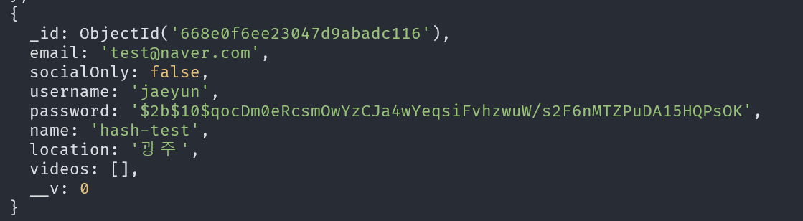
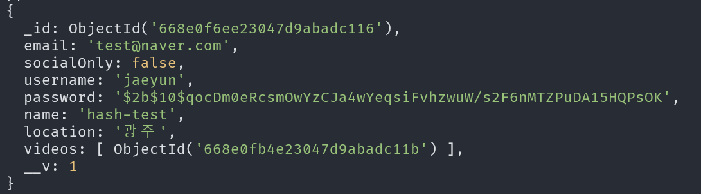

# Wetube
/ - home
 
/join - join
 
/login - login
 
/search - search
 
 
/users/:id - see user
 
/users/logout - log out
 
/users/edit - edit user
 
/user/delete - delete user
 
 
/videos/:id - watch video
 
/videos/:id/edit - edit video
 
/videos/:id/delete - delete video
 
/videos/upload - upload video
 

# DB
영상 -> 1개의 소유자
1명의 소유자 -> 여러개의 영상

# 기능
- session.destory()를 통한 보안유지(해커들이 로직파악 후에 302 redirect를 프록시를 통해서 막은 후에 이전 세션 데이터도 활용할 수 있게 되는거 방지)

- status code를 이용한 불필요한 비밀번호 저장 X(사용자)

- 비밀번호 변경시 로그아웃

- 재사용성 높은 미들웨어

- url 보호
- 세션 존재 o x 에 따라 허가 되는 url컨트롤

- 계정처리

로그인 기능;

랜덤 닉네임 생성

Github oAuth;
scope: user data, email data

세션 유지

깃허브 로그인시, 존재하는 같은 이메일이 있을 경우 -> 깃허브X 해당 계정 로그인 처리 (SocialLogin: false)
존재하지 않는 경우 -> 깃허브를 통한 로그인 (SocialLogin: true)
--> 중복된 이메일 존재 X

카카오 로그인

await user.save();
return res.redirect("/users/logout");

위와 같은 형태로 구현하면 해커들이 로직파악 후에 302 redirect를 프록시를 통해서 막은 후에 이전 세션 데이터도 활용할 수 있게 됩니다. 좀더 안전하게 하려면 아래와 같이 확실하게 destroy해주는게 좋아보여요.

req.session.destroy();
return res.redirect('/login');

추가로 이전비밀번호와 변경비밀번호가 같으면 튕겨주는게 좋을 듯 합니다.

if (oldPassword === newPassword) {
return res.status(400).render('users/change-password', {
pageTitle,
errorMessage: 'The old password equals new password',
});
}

enctype = "multipart/form-data"

# 하고싶은말

express를 통해 유튜브 클론코딩을 했는데, ts를 사용하며했습니다.

기본적으로 express, mongo는 타입검사를 하는 느낌이였기에, ts의 필요성을
몸소 느끼지 못했던거 같습니다. express에서는? (리액튼는 필수!)

구글 답변 결과 express에서 ts사용은 가독성, 오류를 줄여준다는데
현실적으로 좋은 방법인지 잘 모르겠네요!! 조언 부탁드립니다.

# Trouble Shooting
edit -> location이 수정이 안되는 문제 발생
  // CheckPoint-1
  console.log("CP1: ", location);
  - undifined 오류 발생
  req.body를 찍어보니 값들이 넘어오지 않음.
오류 원인 ->   form(method="POST", enctype="multipart/form-data")
아바타 이미지 전달을 위해 인코딩 타입을 다음과 같이 설정해서 넘어오지 않았따.
그렇다고 이미지에 대한 req값은 잘 들어잇나? -> NO, Form 형식에 전체적인 오류 발생

Error: Cannot find module 'multer' 반복

typescript를 쓸 때 기본적인 multer와 @types/multer를 둘다 설치해야한다는걸 몰랐음.

avatarUrl을 userInfo에 연결하고 띄우려했지만, 브라우저에게 express.static("uploads")를 통해 폴더를 보여줄것을 명시했어야햇음.

파일을 서버에 저장? ㄴㄴ 문제 많음. 껏다 켯다 반복 문에!!

user.save 때마다 비밀번호 반복적 해싱
영상을 업로드 할 때도 user.save()를 실행하기 때문에 비밀번호가 두번 해시 됨.

계정 생성후 비밀번호 해시

$2b$10$qocDm0eRcsmOwYzCJa4wYeqsiFvhzwuW/s2F6nMTZPuDA15HQPsOK
해당 계정으로 영상 업로드 시 변경된 해시
$2b$10$qocDm0eRcsmOwYzCJa4wYeqsiFvhzwuW/s2F6nMTZPuDA15HQPsOK

userSchema.pre<IUser>("save", async function (next) {
  // 비밀번호 필드가 수정되지 않았다면, 해싱을 건너뜀.
  // 사용자가 프로필을 업데이트하는 경우..!! 비밀번호 안바꾸면
  // 굳이 해싱할 필요 X - 무결성 + 효율송
  if (!this.isModified('password')) return next();

  const salt = await bcrypt.genSalt(10)
  this.password = await bcrypt.hash(this.password, salt);

  next();
})

js -> 웹팩 사용시
(async()=>{alert("hi im working"),await fetch("")})();

ts -> 웹팩 사용시
(()=>{"use strict";({935:function(){var t=this&&this.__awaiter||function(t,n,e,r){return new(e||(e=Promise))((function(o,i){function a(t){try{c(r.next(t))}catch(t){i(t)}}function u(t){try{c(r.throw(t))}catch(t){i(t)}}function c(t){var n;t.done?o(t.value):(n=t.value,n instanceof e?n:new e((function(t){t(n)}))).then(a,u)}c((r=r.apply(t,n||[])).next())}))},n=this&&this.__generator||function(t,n){var e,r,o,i,a={label:0,sent:function(){if(1&o[0])throw o[1];return o[1]},trys:[],ops:[]};return i={next:u(0),throw:u(1),return:u(2)},"function"==typeof Symbol&&(i[Symbol.iterator]=function(){return this}),i;function u(u){return function(c){return function(u){if(e)throw new TypeError("Generator is already executing.");for(;i&&(i=0,u[0]&&(a=0)),a;)try{if(e=1,r&&(o=2&u[0]?r.return:u[0]?r.throw||((o=r.return)&&o.call(r),0):r.next)&&!(o=o.call(r,u[1])).done)return o;switch(r=0,o&&(u=[2&u[0],o.value]),u[0]){case 0:case 1:o=u;break;case 4:return a.label++,{value:u[1],done:!1};case 5:a.label++,r=u[1],u=[0];continue;case 7:u=a.ops.pop(),a.trys.pop();continue;default:if(!((o=(o=a.trys).length>0&&o[o.length-1])||6!==u[0]&&2!==u[0])){a=0;continue}if(3===u[0]&&(!o||u[1]>o[0]&&u[1]<o[3])){a.label=u[1];break}if(6===u[0]&&a.label<o[1]){a.label=o[1],o=u;break}if(o&&a.label<o[2]){a.label=o[2],a.ops.push(u);break}o[2]&&a.ops.pop(),a.trys.pop();continue}u=n.call(t,a)}catch(t){u=[6,t],r=0}finally{e=o=0}if(5&u[0])throw u[1];return{value:u[0]?u[1]:void 0,done:!0}}([u,c])}}};t(void 0,void 0,void 0,(function(){return n(this,(function(t){switch(t.label){case 0:return alert("hi im working"),[4,fetch("")];case 1:return t.sent(),[2]}}))}))}})[935]()})();

똑같은 코드에 :any type지정만 해줬는데 오히려 코드가 말도 안되게 늘어났다.
웹팩은 크기를 압축하기 위해 사용되는데 오히려 Express에서 ts를 함께 사용하니까 먼가 일도 두번하는 느낌인데, 코드도 더 무거워지는 느낌이 점점 들었다.

babel을 이용한 길이의 약 두배는 나오는 것 같다.

웹팩의 단점으로는 디버깅이 어려운 문제가있는데, 개발 창에서 하면될 껄 꼭 웹팩의 단점을 그런걸로 언급해야할까?

ts-loader 의 사용
